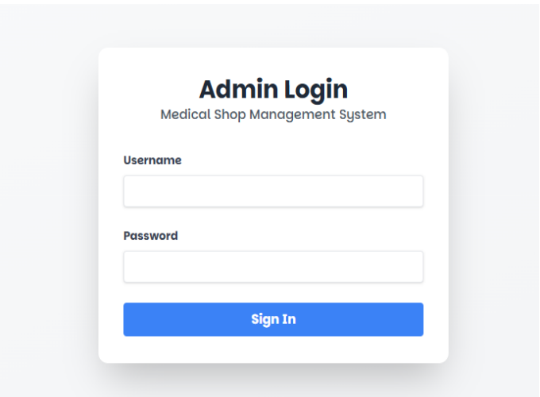
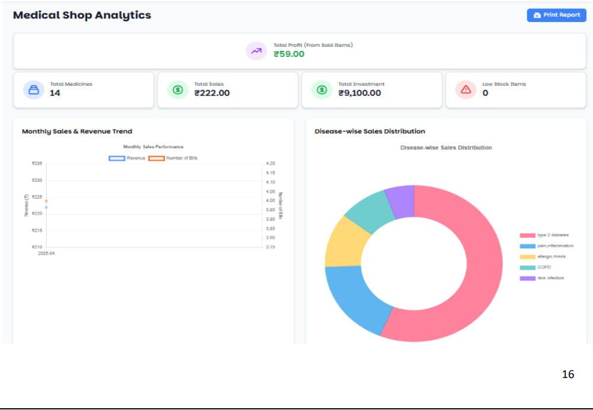
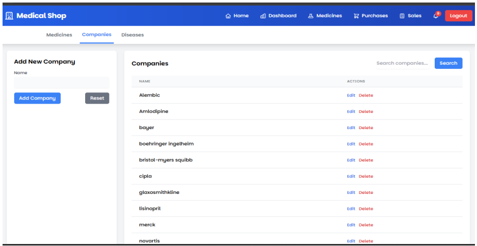
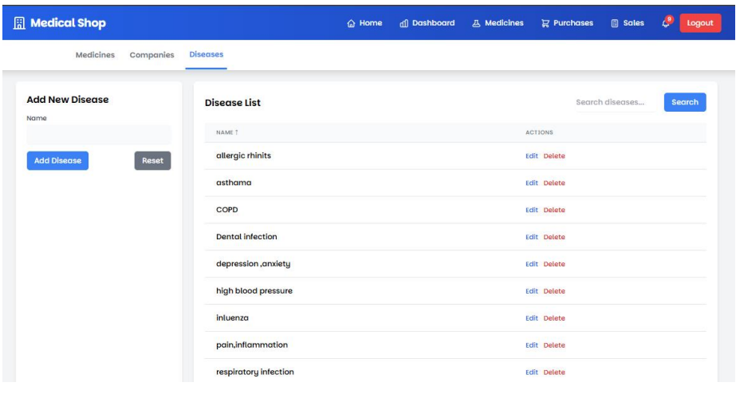
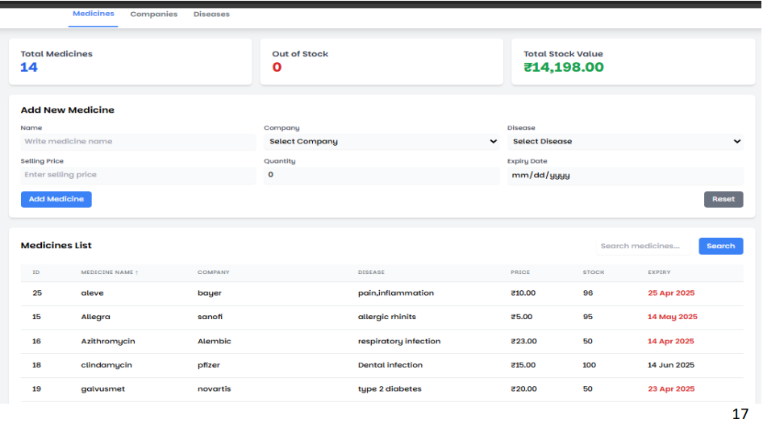
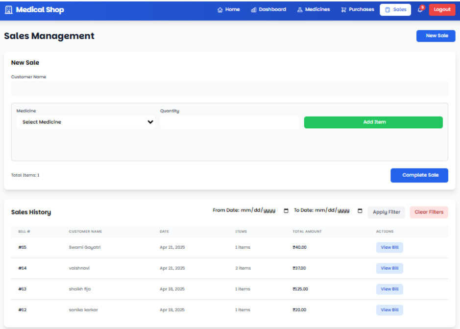

# Medical Shop Management System

## 📌 Project Overview
Medical Shop Management System is a web-based application developed to manage
medicines, companies, diseases, purchases, sales, and inventory efficiently.
The system reduces manual work and helps the admin track stock, expiry dates,
and sales analytics accurately.

---

## 🔐 Admin Login

This page allows the administrator to log in securely using a username and password.
Only authorized users can access the system.

---

## 🏠 Home Page

The home page provides quick access to all major modules like Medicines,
Purchases, Sales, and Dashboard along with system overview.

---

## 📊 Dashboard & Analytics

The dashboard shows total medicines, total sales, profit, low stock alerts,
and graphical analytics such as monthly sales and disease-wise distribution.

---

## 🏢 Company Management

This module allows the admin to add, edit, and delete medicine companies.
Each medicine is associated with a specific manufacturing company.

---

## 🦠 Disease Management

Diseases can be managed in this module.
Medicines are categorized based on diseases for better organization.

---

## 💊 Medicine Management

The medicine module manages medicine details like price, quantity,
expiry date, stock availability, and disease category.

---

## 🛒 Purchase Management

This module records medicine purchases including quantity, purchase price,
purchase date, and expiry date. Stock is updated automatically.

---

## 💰 Sales Management

The sales module is used to sell medicines, generate bills,
and maintain complete sales history for reports.

---

## 🛠 Technologies Used
- PHP
- HTML
- CSS
- JavaScript
- MySQL
- Apache Server (XAMPP)

---
## 🧩 Project Structure

- admin/ → Admin panel & authentication
- assets/ → Images & static files
- css/ → Styling files
- js/ → JavaScript logic
- database/ → Database files
- index.php → Main entry point

## 👨‍💻 Team Members
- Akash waywale
- Ajay thorat
- Ritesh gaikwad 
- Sohel sheaikh

## 🎯 Purpose
This project is developed for academic purposes to understand
web-based application development and database management.

## 🏫 Academic Details
- Diploma in Computer Engineering
- Academic Year: 2025–2026

----

## ▶️ How to Run the Project
1. Install XAMPP / WAMP Server
2. Copy project folder to `htdocs`
3. Import database into MySQL
4. Run project using browser

# msms-project
Academic mini project for management system developed by Akash  waywale,  Ajay thorat  , Ritesh gaikwad and Sohel shekh
